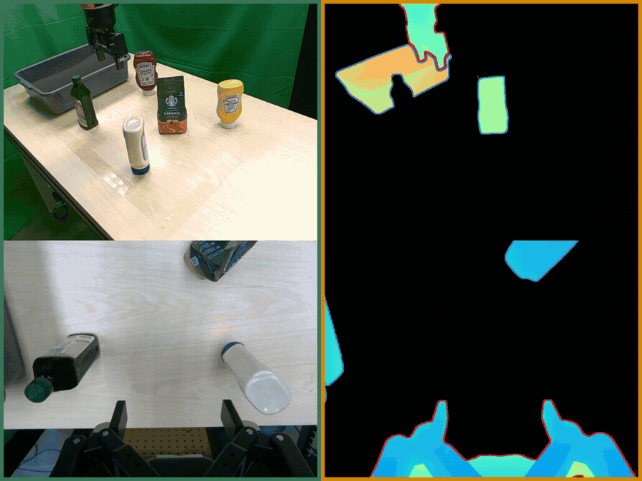

## Overview

Recent Vision-Language-Action models have made strong progress by post-training large Vision-Language Models for action prediction, but many still entangle perception and control in a single monolithic pipeline. In practice, that weakens language-conditioned grounding: policies may over-grasp when the target is absent, drift toward clutter, or overfit to background appearance. OBEYED-VLA addresses this by explicitly separating perceptual grounding from action reasoning before control.

## TL;DR

- **Status:** Under submission at IEEE Transactions on Robotics (T-RO).
- **Problem:** Monolithic VLAs can erode language-conditioned grounding, leading to failure in clutter, absent-target cases, background shifts, and unseen-object manipulation.
- **Method:** OBEYED-VLA disentangles perception from control by grounding multi-view inputs into task-conditioned object-centric and geometry-aware observations before VLA action prediction.
- **Key result:** On a real-world UR10e tabletop setup, the method improves robustness over strong VLA baselines across distractor-heavy, absent-target, background-shift, and unseen-object regimes.

## Qualitative Result: Cluttered Scenes with Distractor Objects

  

In this distractor-scene example, the grounded observations suppress irrelevant objects and preserve the task-relevant target, helping the executor stay aligned with the instruction instead of drifting toward visually salient clutter.

## Project Page

For the full method, additional videos, and quantitative experiments, see the [OBEYED-VLA project page](https://uark-aicv.github.io/OBEYED_VLA/).
